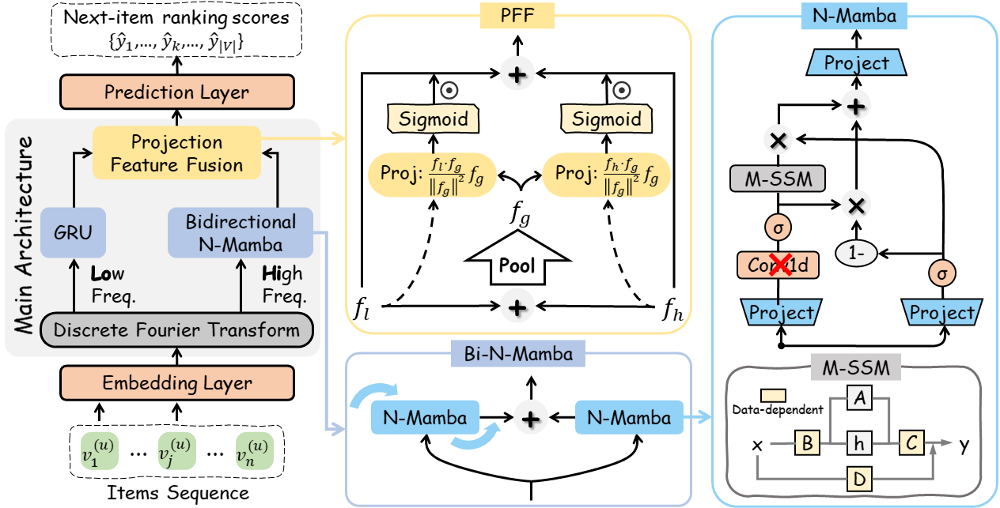

# HiLoMamba: Frequency-aware Decoupling of Long- and Short-term Preferences for Sequential Recommendation

Our model is based on a famous open-source framework [Recbole](https://recbole.io/)

## Overview


## Dataset Preparation
Please, download three widely used benchmarks from [RecSysDatasets](https://github.com/RUCAIBox/RecSysDatasets) or [Google Drive](https://drive.google.com/drive/folders/1ahiLmzU7cGRPXf5qGMqtAChte2eYp9gI) constructed by RecBole's team.

## Training & Inference
You can find our experimental logging files in `./exp_log` and you can execute the following code in the terminal.
```
# Amazon_Handmade_Products
python run_recbole.py --gpu_id='0' --model=HiLoMamba --dataset='Amazon_Handmade_Products' --config_files='config/Amazon_Handmade_Products.yaml'

# Amazon_Video_Games
python run_recbole.py --gpu_id='0' --model=HiLoMamba --dataset='Amazon_Video_Games' --config_files='config/Amazon_Video_Games.yaml' 

# Steam
python run_recbole.py --gpu_id='0' --model=HiLoMamba --dataset='steam' --config_files='config/steam.yaml'
```
